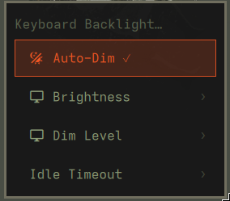

# omarchy-kbd-backlight

Dims your keyboard backlight when you're idle, and restores it when you type or move the mouse. For Omarchy (Hyprland).



## Requirements

- Omarchy
- `brightnessctl`
- a keyboard backlight controllable via `brightnessctl` (device `kbd_backlight`)

Tested only on a MacBook Air M2 (Apple Silicon) running Omarchy via Asahi Linux. Should work on other machines with a `kbd_backlight` device, but not verified.

## Install

```bash
curl -fsSL https://raw.githubusercontent.com/Inspiractus01/omarchy-kbd-backlight/main/install.sh | bash
```

Or clone it first if you'd rather read the script before running it:

```bash
git clone https://github.com/Inspiractus01/omarchy-kbd-backlight.git
cd omarchy-kbd-backlight
./install.sh
```

The installer asks whether it should keep itself updated automatically
whenever you run `omarchy update`. Say no, and you'll need to rerun
`install.sh` yourself to pick up future fixes.

## Uninstall

```bash
curl -fsSL https://raw.githubusercontent.com/Inspiractus01/omarchy-kbd-backlight/main/uninstall.sh | bash
```

## Use

Open the Omarchy menu (`SUPER+SPACE`), search "Keyboard Backlight". You can:

- turn auto-dim on/off
- set brightness (10/25/50/75/100%)
- set the dim level (0/5/10%)
- set the idle timeout (5/10/20/30/60s)

Or from the terminal:

```bash
omarchy-kbd-backlight brightness 50
omarchy-kbd-backlight dim-percent 0
omarchy-kbd-backlight timeout 10
omarchy-kbd-backlight auto-dim toggle
```

## Notes

Two issues are worked around automatically, no action needed on your part:

- A video or call in a browser tab (YouTube, a Discord tab, etc.) holds a
  Wayland idle-inhibit lock that would otherwise block dimming entirely
  while it's active.
- `hypridle`'s idle-notifier connection can occasionally wedge, most often
  right after a suspend/resume cycle -- the process stays running but stops
  reacting to input, so the backlight can get stuck dimmed. A watcher
  restarts the service the moment the system resumes, and a 15-minute
  watchdog timer catches any other case.

## License

MIT
